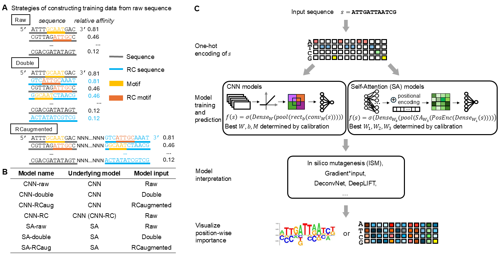

## Sequenced-based modeling of low-affinity transcription factor–DNA binding through deep learning

Multiple layers of determinants and mechanisms affect binding specificities between transcription factors (TFs) and DNA. DNA sequence-based deep learning models using convolutional neural networks (CNNs) and self-attention (SA) transformers have improved modeling accuracy and advanced understanding of TF–DNA binding specificity through network interpretation. However, the systematic evaluation of various strategies for handling DNA sequence orientations in deep learning models—and their interpretation—remains underexplored, especially in the context of learning low-affinity binding site specificity. Using SELEX-seq data of eight Exd-Hox heterodimers in Drosophila, we compared canonical models with data augmentation and reverse-complement weight-sharing models. We found that reverse-complement weight-sharing CNN models and SA models trained with augmented data with all reverse complements performed the best in modeling binding specificity. Next, we evaluated several interpretation methods, including Gradient*input, DeconvNet, DeepLIFT, and in silico mutagenesis (ISM). Compared to other interpretation methods, ISM was less sensitive to different hyperparameter settings. Finally, we identified Exd-Ubx binding at low-affinity sites and suggested possible biophysical mechanisms. 
This repository contains code used in our manuscript.

 